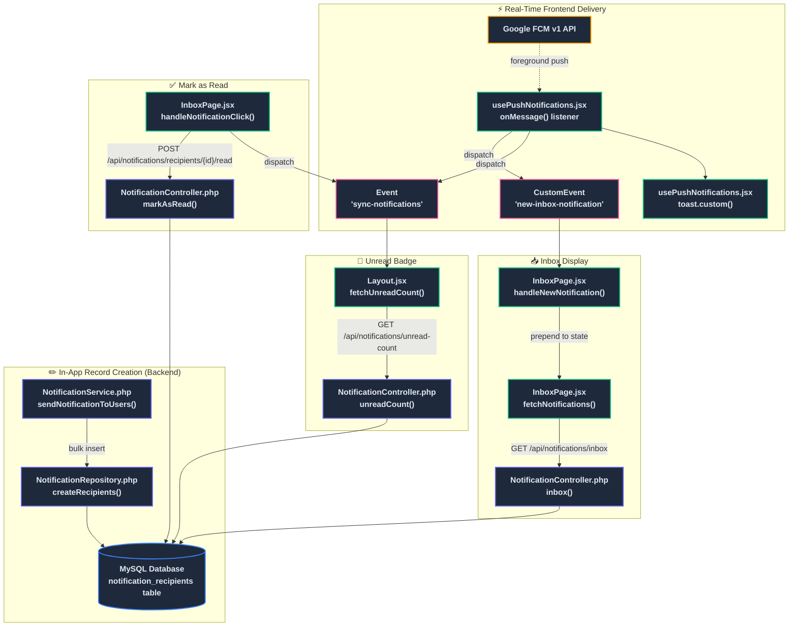
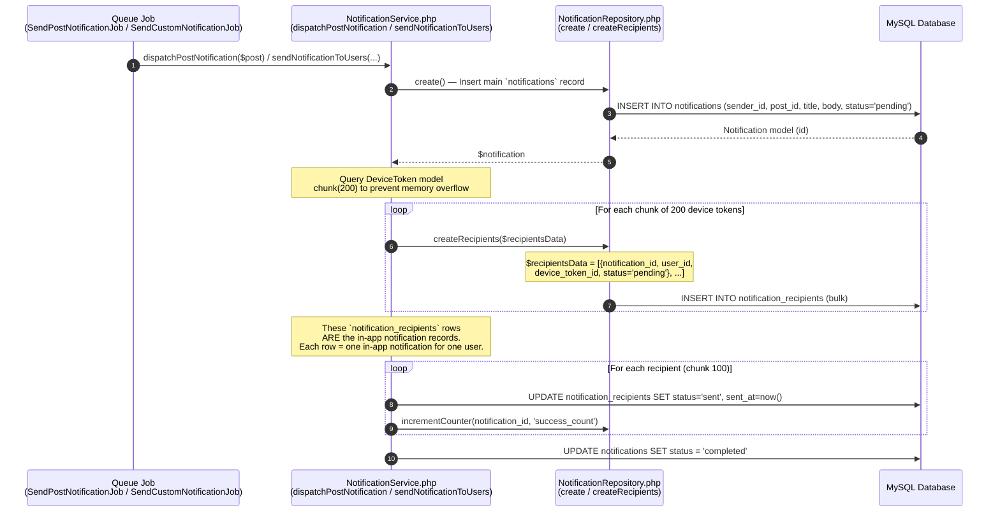
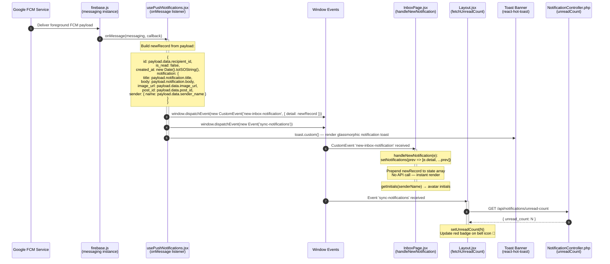
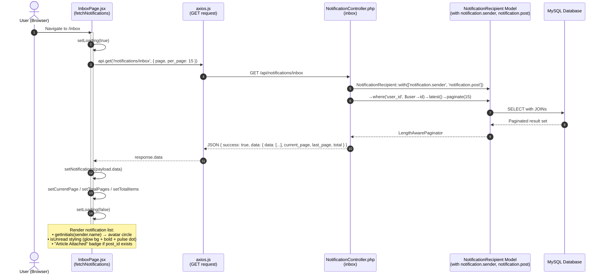
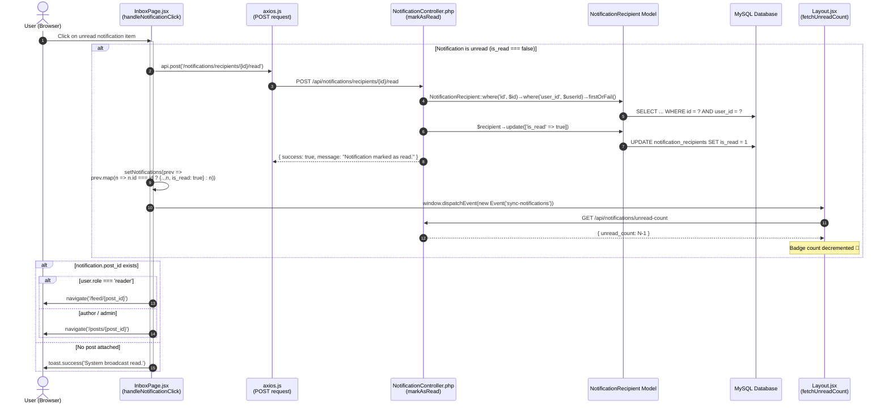
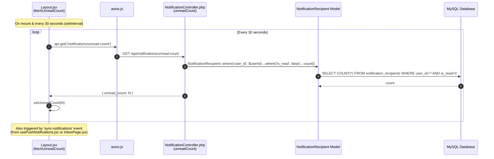
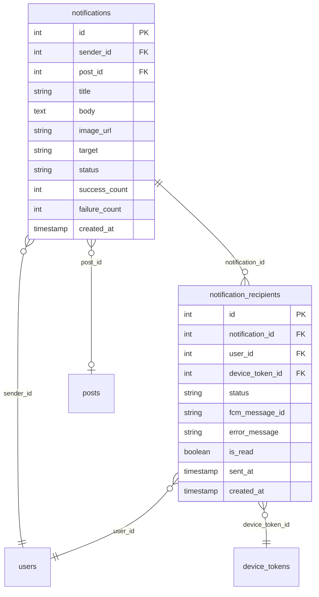
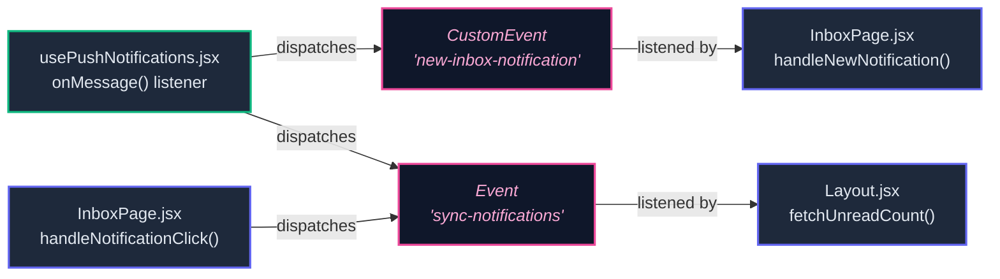

# In-App Notification — Data Flow Diagram

This document visualizes how **In-App (Database) Notifications** are created, stored, delivered in real-time, displayed in the inbox, and marked as read — mapping each step to the exact **filename** and **method name** responsible.

---

## 1. High-Level Flow Overview

---

## 2. Sequence Diagram — In-App Record Creation

This shows how `notification_recipients` records (the in-app notification log) are created during the push dispatch pipeline.

---

## 3. Sequence Diagram — Real-Time Foreground Delivery & UI Prepend

When a push notification arrives while the user has the app open, this flow handles **instant in-app display** without page reload.

---

## 4. Sequence Diagram — Inbox Page Load (API Fetch)

When a user navigates to the `/inbox` page, notifications are fetched from the database.

---

## 5. Sequence Diagram — Mark as Read

---

## 6. Sequence Diagram — Unread Badge Polling & Sync

---

## 7. File & Method Reference Table

### Backend — `notification-api/`

| # | File Path | Method | In-App Role |
|---|-----------|--------|-------------|
| 1 | `app/Services/NotificationService.php` | `sendNotificationToUsers()` | Creates `notification_recipients` records — **these ARE the in-app notifications** |
| 2 | `app/Repositories/NotificationRepository.php` | `create()` | Inserts parent `notifications` record (campaign-level) |
| 3 | `app/Repositories/NotificationRepository.php` | `createRecipients()` | Bulk-inserts `notification_recipients` rows (per-user in-app records) |
| 4 | `app/Repositories/NotificationRepository.php` | `incrementCounter()` | Atomically updates `success_count` / `failure_count` on parent |
| 5 | `app/Http/Controllers/NotificationController.php` | `inbox()` | Returns paginated inbox: queries `notification_recipients` with `notification.sender` & `notification.post` |
| 6 | `app/Http/Controllers/NotificationController.php` | `unreadCount()` | Returns count of unread `notification_recipients` for current user |
| 7 | `app/Http/Controllers/NotificationController.php` | `markAsRead()` | Sets `is_read = true` on a specific `notification_recipients` row |
| 8 | `app/Models/NotificationRecipient.php` | — (Model) | Eloquent model for `notification_recipients` table with relationships |
| 9 | `app/Models/Notification.php` | — (Model) | Eloquent model for `notifications` table (parent campaign record) |

### Frontend — `notification-admin/src/`

| # | File Path | Method / Handler | In-App Role |
|---|-----------|------------------|-------------|
| 1 | `hooks/usePushNotifications.jsx` | `onMessage()` listener | Intercepts foreground FCM push, constructs `newRecord` matching inbox API shape |
| 2 | `hooks/usePushNotifications.jsx` | `window.dispatchEvent('new-inbox-notification')` | Dispatches CustomEvent carrying `newRecord` to prepend into inbox |
| 3 | `hooks/usePushNotifications.jsx` | `window.dispatchEvent('sync-notifications')` | Triggers badge count refresh in Layout |
| 4 | `hooks/usePushNotifications.jsx` | `toast.custom()` | Renders clickable glassmorphic toast with navigate-on-click |
| 5 | `pages/InboxPage.jsx` | `fetchNotifications()` | Loads paginated inbox via `GET /api/notifications/inbox` |
| 6 | `pages/InboxPage.jsx` | `handleNewNotification()` | Listens for `'new-inbox-notification'` event, prepends to state array |
| 7 | `pages/InboxPage.jsx` | `handleNotificationClick()` | Marks notification as read via API, updates local state, syncs badge, navigates |
| 8 | `pages/InboxPage.jsx` | `getInitials()` | Computes avatar initials from sender name |
| 9 | `components/Layout.jsx` | `fetchUnreadCount()` | Fetches unread count via `GET /api/notifications/unread-count` |
| 10 | `components/Layout.jsx` | `setInterval(fetchUnreadCount, 30000)` | Polls unread count every 30 seconds |
| 11 | `components/Layout.jsx` | `addEventListener('sync-notifications')` | Re-fetches unread count on event |

### API Routes — `routes/api.php`

| Route | Method | Controller → Action | Purpose |
|-------|--------|---------------------|---------|
| `GET /api/notifications/inbox` | GET | `NotificationController@inbox` | Fetch user's in-app notification list |
| `GET /api/notifications/unread-count` | GET | `NotificationController@unreadCount` | Get unread notification count |
| `POST /api/notifications/recipients/{id}/read` | POST | `NotificationController@markAsRead` | Mark single notification as read |

---

## 8. Database Schema — In-App Notification Tables

> **Key Insight**: The `notification_recipients` table serves a **dual purpose** — it tracks FCM push delivery status (status, fcm_message_id, error_message) AND functions as the in-app notification inbox (is_read, user_id). Each row in this table represents one in-app notification for one user.

---

## 9. Custom Event Communication Map

| Event Name | Dispatched By | Listened By | Purpose |
|-----------|---------------|-------------|---------|
| `new-inbox-notification` | `usePushNotifications.jsx` → `onMessage()` | `InboxPage.jsx` → `handleNewNotification()` | Prepend new notification to inbox state in real-time |
| `sync-notifications` | `usePushNotifications.jsx` → `onMessage()` AND `InboxPage.jsx` → `handleNotificationClick()` | `Layout.jsx` → `fetchUnreadCount()` | Refresh unread badge count in header |
