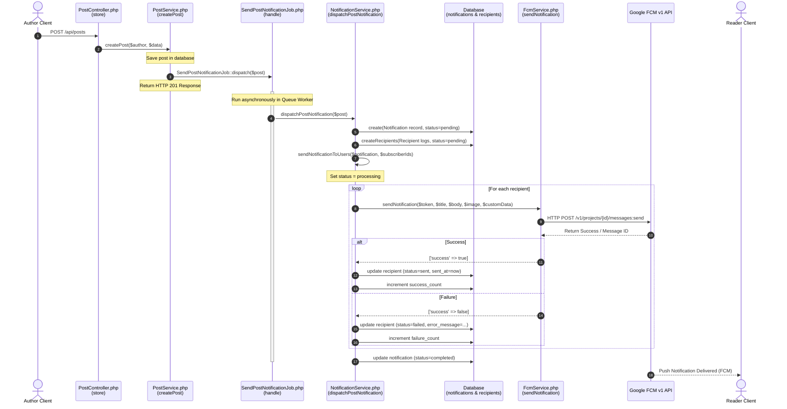
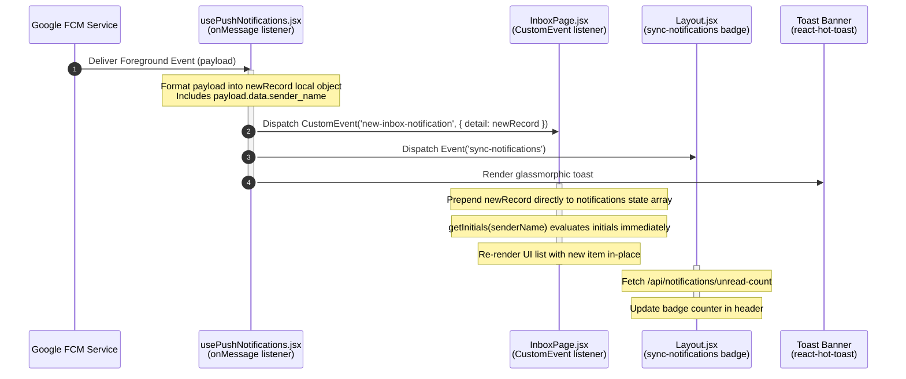

# Notification System Flow Documentation

This document explains how **Push Notifications** (via Google FCM v1) and **In-App/Database Notifications** are generated, queued, dispatched, and handled in real-time between the Laravel API backend and the React frontend.

---

## 1. Visual Data Flow Map

This flowchart maps the precise file names, method names, and data payloads exchanged at each step:

```mermaid
graph TD
    %% Styling Definitions
    classDef fileNode fill:#2d3748,stroke:#4a5568,stroke-width:2px,color:#edf2f7,font-weight:bold;
    classDef dataNode fill:#1a202c,stroke:#3182ce,stroke-width:1px,color:#63b3ed,font-style:italic;

    %% Nodes
    A["PostController.php <br> [store()]"]:::fileNode
    D1["Data: User $author & array $data <br> [title, body, image_url]"]:::dataNode
    
    B["PostService.php <br> [createPost()]"]:::fileNode
    D2["Data: Post $post <br> [id, author_id, title, body, image_url]"]:::dataNode
    
    C["SendPostNotificationJob.php <br> [handle()]"]:::fileNode
    D3["Data: Post $post <br> (Eager loads 'author' relationship)"]:::dataNode
    
    D["NotificationService.php <br> [dispatchPostNotification()]"]:::fileNode
    D4["Data: Notification $notification <br> (Linked post & sender user relations)"]:::dataNode
    
    E["NotificationService.php <br> [sendNotificationToUsers()]"]:::fileNode
    D5["Data: customData array <br> [recipient_id, sender_name, post_id]"]:::dataNode
    
    F["FcmService.php <br> [sendNotification()]"]:::fileNode
    D6["FCM v1 JSON Payload <br> { message: { token, notification: {...}, data: {...} } }"]:::dataNode
    
    G["usePushNotifications.jsx <br> [onMessage() listener]"]:::fileNode
    D7["Data: newRecord object <br> { id, is_read: false, notification: { title, body, post_id, sender: { name } } }"]:::dataNode
    
    H["InboxPage.jsx <br> [CustomEvent listener]"]:::fileNode
    D8["Appended to local state array <br> getInitials(senderName) computes initials immediately"]:::dataNode

    %% Connections
    A --> D1
    D1 --> B
    B --> D2
    D2 --> C
    C --> D3
    D3 --> D
    D --> D4
    D4 --> E
    E --> D5
    D5 --> F
    F --> D6
    D6 --> G
    G --> D7
    D7 --> H
    H --> D8
```



---

## 2. Sequence Flow Diagrams

### Flow A: New Post Notification Flow
This diagram illustrates the lifecycle of a notification triggered by publishing a post.



---

### Flow B: Foreground Delivery & Real-Time In-App Prepend
This diagram shows how the React frontend intercepts the notification and updates the UI without requiring a page reload.



---

## 2. Key Backend Components & Methods

### 1. `PostService.php`
* **Method**: `createPost(User $author, array $data)`
* **Role**: Handles database creation of a post and triggers the queued background job `SendPostNotificationJob` to decouple the FCM HTTP delivery latency from the HTTP response.

### 2. `SendPostNotificationJob.php`
* **Method**: `handle(NotificationService $notificationService)`
* **Role**: Deserializes the post model, eager loads the `author` relation to prevent serialization issues inside the queue worker, and delegates the notification generation to `NotificationService`.

### 3. `NotificationService.php`
* **Method**: `dispatchPostNotification(\App\Models\Post $post)`
  * Creates the main `Notification` entry with `post_id`, `sender_id` (author), `title`, and `body`.
  * Gathers subscriber user IDs for the author using `SubscriptionRepository`.
  * Invokes `sendNotificationToUsers`.
* **Method**: `sendNotificationToUsers(Notification $notification, ?array $userIds)`
  * Creates entries in the `notification_recipients` table (representing database/in-app notification logs).
  * Gathers active device tokens for the recipients.
  * Formats `customData` payload containing string values:
    * `recipient_id`: The ID of the `notification_recipients` log record (crucial for marking as read).
    * `sender_name`: Eager-loaded `$notification->sender->name` (which prevents showing fallback values).
    * `post_id`: The related post ID.
  * Triggers push sending via `FcmService`.

### 4. `FcmService.php`
* **Method**: `sendNotification(string $deviceToken, string $title, string $body, ?string $imageUrl, array $data)`
* **Role**: Builds the FCM v1 JSON payload, requests Google API OAuth2 access tokens, handles HTTP communication, and gracefully catches invalid token responses to clean up stale device records automatically.

---

## 3. Key Frontend Components & Event Flow

### 1. `usePushNotifications.jsx`
* **Foreground Handler**:
  * Registers `onMessage(messaging, callback)` when initialized.
  * When a push is received while the user is actively viewing the app:
    1. Grabs `payload.data.recipient_id`, `payload.data.sender_name`, and `payload.data.post_id`.
    2. Constructs a simulated `newRecord` object matching the API JSON structure of `/api/notifications/inbox` exactly.
    3. Fires custom event `'new-inbox-notification'` to update `/inbox` listing in real-time.
    4. Fires `'sync-notifications'` to update header counts.
    5. Triggers a clickable, glassmorphic toast notification.

### 2. `InboxPage.jsx`
* **State Prepending**:
  * Subscribes to window event `'new-inbox-notification'`.
  * Prepend handler:
    ```javascript
    const handleNewNotification = (e) => {
      const newRecord = e.detail;
      setNotifications((prev) => [newRecord, ...prev]);
    };
    ```
  * Displays the sender avatar initials by running `getInitials(notification.sender?.name || 'System Broadcast')`.
* **Mark as Read**:
  * Triggers `handleNotificationClick(recipientRecord)`.
  * Calls `POST /api/notifications/recipients/{id}/read` to persist the read state, updates the state list item directly to avoid reloading, and syncs the header unread badge.
