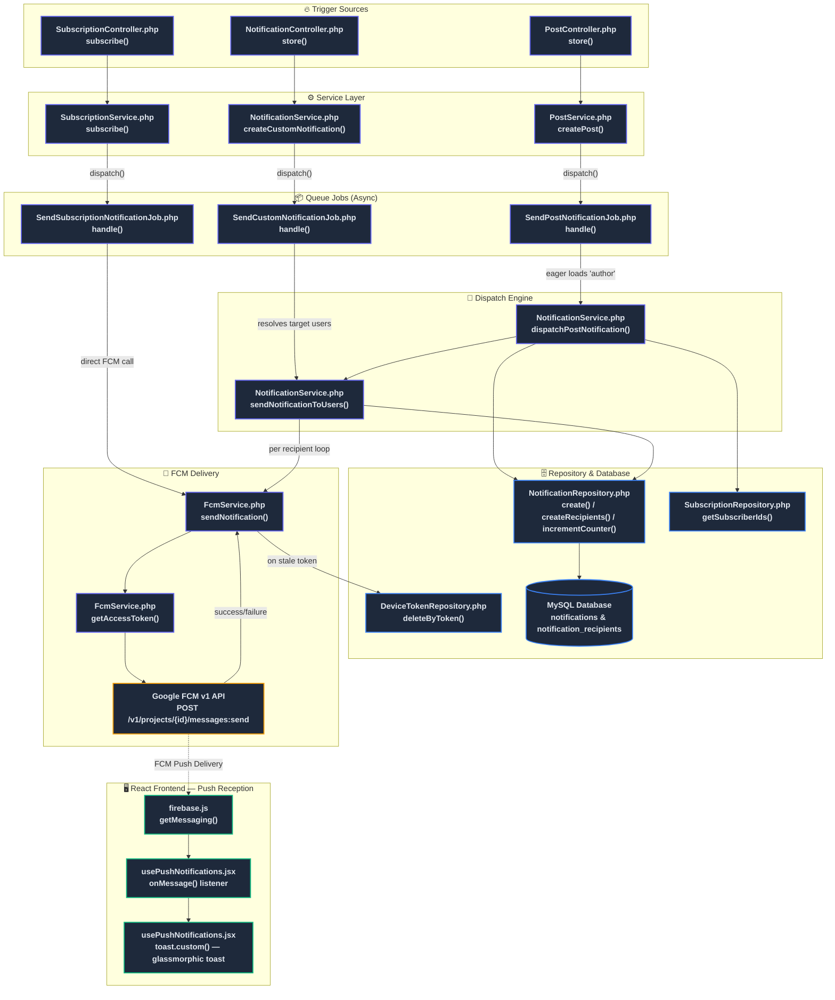
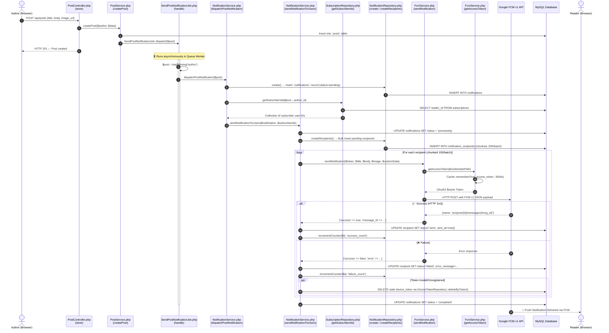
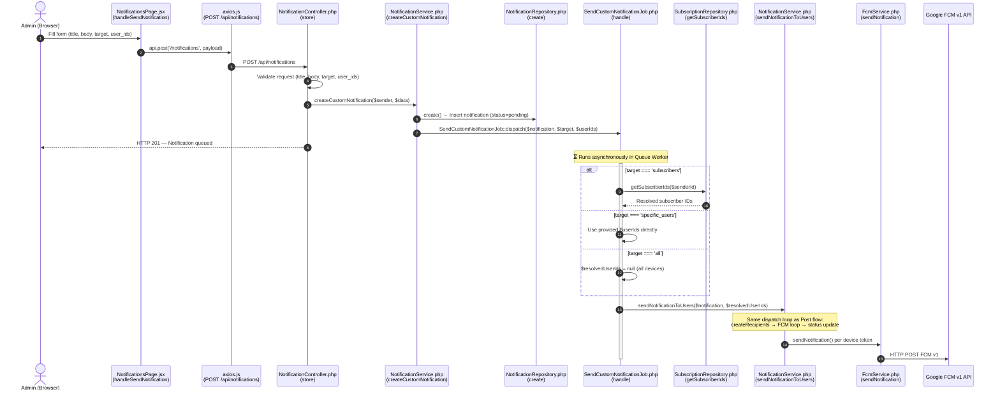
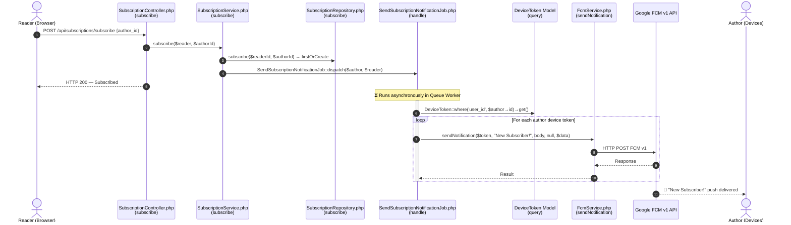
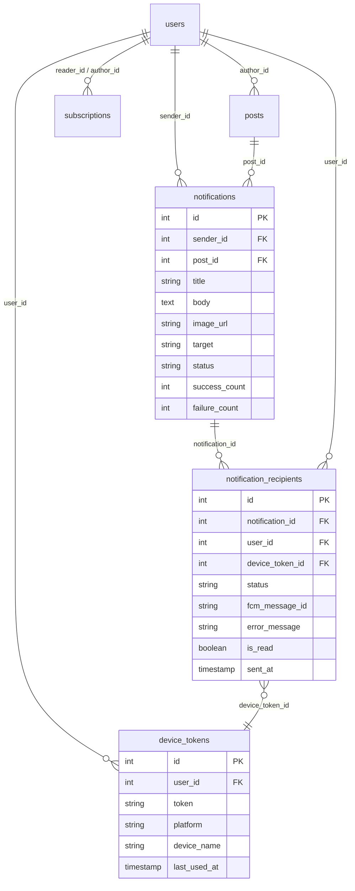

# Push Notification — Data Flow Diagram

This document visualizes how **Push Notifications** (via Google FCM v1) flow through the system, mapping each step to the exact **filename** and **method name** responsible.

---

## 1. High-Level Flow Overview



---

## 2. Detailed Sequence Diagram — Post-Triggered Push



---

## 3. Detailed Sequence Diagram — Custom Admin Push



---

## 4. Detailed Sequence Diagram — Subscription Push



---

## 5. File & Method Reference Table

### Backend — `notification-api/`

| # | File Path | Method | Role |
|---|-----------|--------|------|
| 1 | `app/Http/Controllers/PostController.php` | `store()` | Validates input, calls `PostService::createPost()` |
| 2 | `app/Services/PostService.php` | `createPost()` | Saves post to DB, dispatches `SendPostNotificationJob` |
| 3 | `app/Jobs/SendPostNotificationJob.php` | `handle()` | Eager-loads author, calls `NotificationService::dispatchPostNotification()` |
| 4 | `app/Http/Controllers/NotificationController.php` | `store()` | Validates custom push form, calls `NotificationService::createCustomNotification()` |
| 5 | `app/Services/NotificationService.php` | `createCustomNotification()` | Creates notification record, dispatches `SendCustomNotificationJob` |
| 6 | `app/Jobs/SendCustomNotificationJob.php` | `handle()` | Resolves target users (all/subscribers/specific), calls `sendNotificationToUsers()` |
| 7 | `app/Http/Controllers/SubscriptionController.php` | `subscribe()` | Validates subscription, calls `SubscriptionService::subscribe()` |
| 8 | `app/Services/SubscriptionService.php` | `subscribe()` | Creates subscription record, dispatches `SendSubscriptionNotificationJob` |
| 9 | `app/Jobs/SendSubscriptionNotificationJob.php` | `handle()` | Fetches author device tokens, sends FCM push directly via `FcmService` |
| 10 | `app/Services/NotificationService.php` | `dispatchPostNotification()` | Creates notification + recipients, resolves subscribers, invokes `sendNotificationToUsers()` |
| 11 | `app/Services/NotificationService.php` | `sendNotificationToUsers()` | Chunks recipients, creates DB logs, iterates FCM sending, tracks success/failure |
| 12 | `app/Services/FcmService.php` | `sendNotification()` | Builds FCM v1 JSON payload, handles HTTP POST to Google API |
| 13 | `app/Services/FcmService.php` | `getAccessToken()` | Fetches & caches Google OAuth2 token (3500s TTL) |
| 14 | `app/Services/FcmService.php` | `sendMockNotification()` | Simulates push delivery in dev/test mode |
| 15 | `app/Repositories/NotificationRepository.php` | `create()` | Inserts `notifications` table record |
| 16 | `app/Repositories/NotificationRepository.php` | `createRecipients()` | Bulk-inserts `notification_recipients` rows |
| 17 | `app/Repositories/NotificationRepository.php` | `incrementCounter()` | Atomically increments `success_count` or `failure_count` |
| 18 | `app/Repositories/SubscriptionRepository.php` | `getSubscriberIds()` | Plucks `reader_id` from `subscriptions` for an author |
| 19 | `app/Repositories/DeviceTokenRepository.php` | `deleteByToken()` | Removes stale/invalid FCM device tokens |

### Frontend — `notification-admin/src/`

| # | File Path | Method / Handler | Role |
|---|-----------|------------------|------|
| 1 | `firebase.js` | `getMessaging()` | Initializes Firebase Cloud Messaging instance |
| 2 | `hooks/usePushNotifications.jsx` | `onMessage()` listener | Receives foreground FCM push, builds `newRecord` object |
| 3 | `hooks/usePushNotifications.jsx` | `requestAndRegister()` | Requests browser permission, fetches FCM token, saves to backend |
| 4 | `hooks/usePushNotifications.jsx` | `unregister()` | Deletes FCM token from backend & localStorage |
| 5 | `hooks/usePushNotifications.jsx` | `toast.custom()` | Renders glassmorphic clickable toast notification |
| 6 | `pages/NotificationsPage.jsx` | `handleSendNotification()` | Author/Admin form: POSTs custom push to `/api/notifications` |
| 7 | `components/Layout.jsx` | `usePushNotifications()` init | Auto-prompts permission on login if status is `default` |

### API Routes — `routes/api.php`

| Route | Method | Controller → Action |
|-------|--------|---------------------|
| `POST /api/posts` | POST | `PostController@store` |
| `POST /api/notifications` | POST | `NotificationController@store` |
| `POST /api/subscriptions/subscribe` | POST | `SubscriptionController@subscribe` |
| `POST /api/device-tokens` | POST | `DeviceTokenController@store` |
| `DELETE /api/device-tokens` | DELETE | `DeviceTokenController@destroy` |

---

## 6. FCM v1 Payload Structure

```json
{
  "message": {
    "token": "<device_fcm_token>",
    "notification": {
      "title": "New Post Published!",
      "body": "AuthorName has published: \"Post Title\""
    },
    "data": {
      "recipient_id": "42",
      "sender_name": "AuthorName",
      "post_id": "7"
    },
    "android": {
      "notification": { "image": "<image_url>" }
    },
    "apns": {
      "payload": { "aps": { "mutable-content": 1 } },
      "fcm_options": { "image": "<image_url>" }
    },
    "webpush": {
      "notification": { "image": "<image_url>" }
    }
  }
}
```

---

## 7. Database Tables Involved


